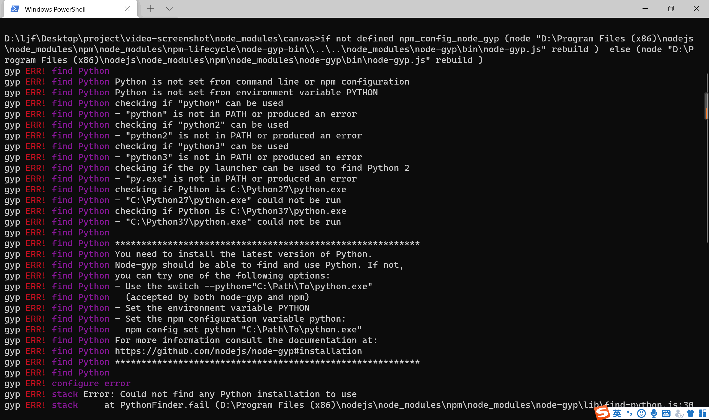

# video-screenshot-tool

视频缩略图生成工具，并合成一张完整的精灵图

## 安装

```bash
npm i video-screenshot-tool  -g
```

## 使用

```bash
video-screenshot --input demo.mp4
```

## 参数

| 参数      | 说明                                                                                           |
| --------- | ---------------------------------------------------------------------------------------------- |
| --input   | 视频地址，可以是本地路径，也可以是网络地址                                                     |
| --output  | 图片输出路径，可选，默认是 ./screenshot.png                                                    |
| --quality | 图片清晰度，可选，默认是 60                                                                    |
| --count   | 一共截取多少帧画面，可选，默认是 100。建议填写这个参数，数量取视频的总秒数，确保每一秒都有画面 |

## 查看版本号

```bash
video-screenshot --version
```

## 注意

安装的时候可能会出现如下报错，可忽略不管，不会影响正常使用。

